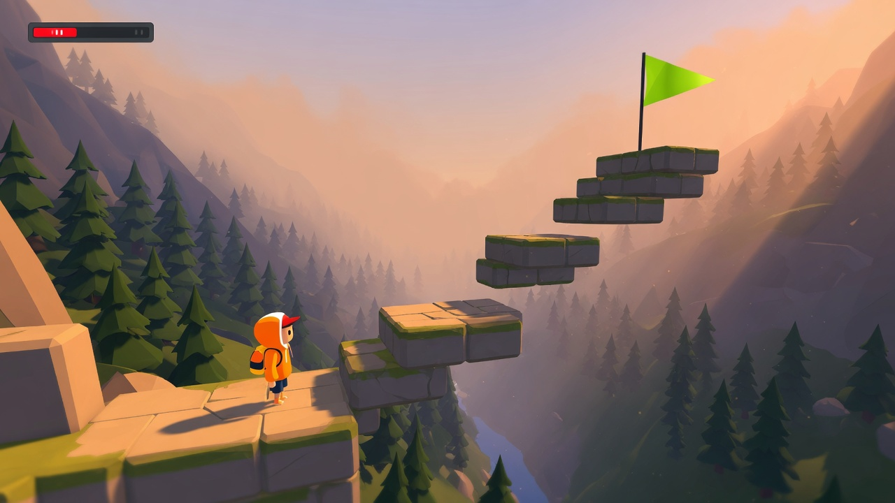
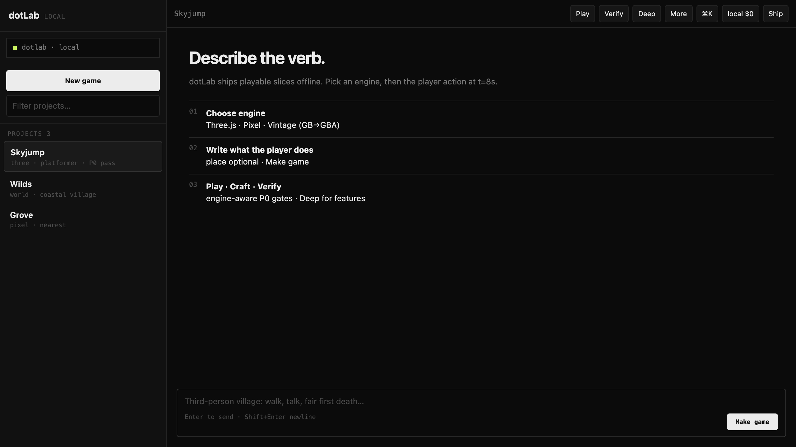
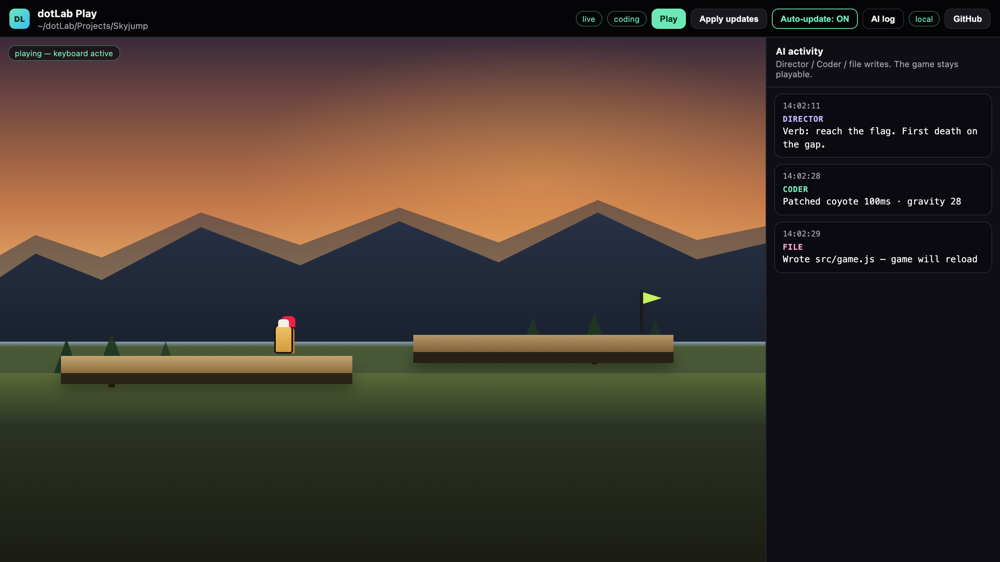
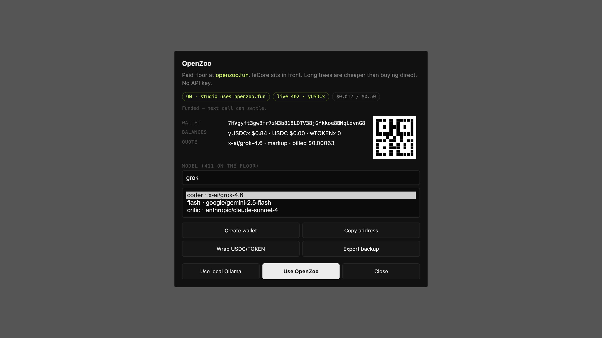
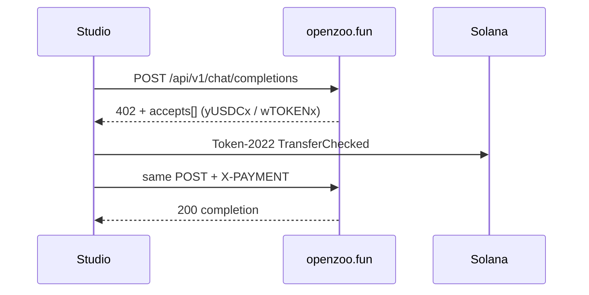

# dotLab

**A local AI game studio that ships playable games — not chat logs.**

You describe a verb. DotLab scaffolds a real project, fills a vertical slice you can run, and keeps iterating while the game stays open. Models run on your machine. The quality bar is enforced by the host, not left to the model’s good intentions.

<p align="center">
  
</p>

<p align="center">
  <em>A cube on a plane is a fail. A ledge, a jump, and a flag is a start.</em>
</p>

[](LICENSE)

---

## What you get

Three windows. That is the whole product.

- **Studio** (`./start`) — projects, composer, Play / Verify / Deep, the `local $0` chip.
- **Play** (`dotlab live` or the Play button) — the game fills the window. The agent writes files. You keep jumping.
- **OpenZoo** — click the status chip. Wallet, wrap, quote, spend cap. Off until you turn it on.

Chrome shots below match the real UI. The hero is the quality bar the host is trying to hit.

---

## Why this exists

Most AI coding tools optimize for *looking busy*: more files, more tokens, more confidence. Games punish that. A green capsule on a plane is not a game. A plaza with one hoop is not a race. A jump that never lands on a ledge is not a platformer.

DotLab is built around a different bet:

1. **The host owns the floor.** Feel numbers, opposition counts, ledges, gates, doors, and death rules are applied by the studio — not invented in prose.
2. **The model works in a tight loop.** It peeks at the project, patches one system at a time, and stops when the slice passes a real grade.
3. **Local is the default.** [Ollama](https://ollama.com) runs the stack. Paid models exist only if you turn them on.

One prompt can still open a world. The difference is what “done” means: a project you can play, measure, and ship.

---

## Strengths

| Strength | What you feel |
|----------|----------------|
| **Playable first** | Scaffold → `npm run dev` → controls work. No empty repo ceremony. |
| **Host quality floor** | Place, body, verb, opposition, juice. Missing a pillar fails the slice. |
| **Studio that builds** | Director → Architect → recursive coder → Critic. Not a single dump into `game.js`. |
| **Live iteration** | The Play window stays open while files change. Test while the agent works. |
| **Deterministic verify** | `verify` grades structure and genre contracts without calling a model. P0 fail blocks “done”. |
| **Skill routing** | The agent asks the catalog what exists. Unknown tools do not invent themselves. |
| **Worlds from a sentence** | Regions, height field, instances — walkable Three.js you can keep editing. |
| **$0 local path** | Game-tuned models on Ollama. Cloud is opt-in, never ambient. |
| **OpenZoo option** | [openzoo.fun](https://openzoo.fun/) paid floor: leCore in front, x402, no API key. Long trees cheaper than buying the model direct. |
| **Ship path** | Private GitHub repo in one command when you are ready. |

---

## The loop

```
describe a verb  →  real project  →  studio build  →  play while it writes
                                              ↓
                                    verify (no LLM)  →  ship
```

1. You write what the player does at t=8s.
2. The host scaffolds a Vite project (not a chat attachment).
3. Studio roles design the slice, then a deep coder peeks the tree and patches one pillar at a time.
4. Play stays open. Auto-update reloads the game. You jump the gap while gravity changes.
5. `dotlab verify -p .` grades place / body / verb / opposition / juice. P0 fail = not done.
6. `dotlab ship` pushes a private GitHub repo when you want it off the laptop.

Undo a bad agent step with `dotlab kit undo -p DIR`. Recap the session with `dotlab kit recap -p DIR`.

---

## Studio



`./start` opens this. Ollama must be running.

| Control | What it does |
|---------|----------------|
| **New game** | Scaffold a project into `~/dotLab/Projects`. |
| Project list | Filter by engine. Click to focus. Meta line is engine · genre · last verify. |
| **Play** | Opens the Play window on this project (`dotlab live`). |
| **Verify** | Host grade. No model. P0 fail stays a fail. |
| **Deep** | File agent for systems (dialogue, weapons, AI) — not feel numbers. |
| **More** | Folder, terminal, zip, rename, keep-feel / tighter / juice. The game loop stays in the header. |
| **⌘K** | Command palette. |
| **local $0** / **zoo · $0.01** | Status chip. Click it to open the OpenZoo yard. This is where money lives. |
| **Ship** | Private GitHub repo for the focused game. |
| Composer | Enter sends. “Make game” starts a slice from the verb. |

The composer is the front door. The header is the craft loop. Folder / Term / Zip stay under **More** so they do not compete with Play.

---

## Play



This window is for **playing**, not configuring models.

| Control | What it does |
|---------|----------------|
| **Play** | Focus the game so keyboard and mouse go to the iframe. |
| **Apply updates** | Reload now if you turned auto-update off. |
| **Auto-update** | Default on. File writes from the studio land while you play. |
| **AI log** | Director / Coder / file events. The game stays on the left. |
| **local** / **zoo** pill | Who is coding. Read-only. There is **no wallet modal** here. |
| **GitHub** | Ship this game. |

Click the game to capture input. Updates from the studio apply live, or queue until you hit Apply. Manage OpenZoo in Studio — Play only shows the pill so you know whether the coder is local or paid.

---

## What you can make

- **Web games** — Three.js vertical slices (FPS, platformer, runner, race, adventure, more)
- **Pixel games** — Canvas2D bake path with nearest-filter feel
- **Vintage** — Game Boy ship bar, hard GBA ceiling
- **Open worlds** — prompt → regions → terrain → instances
- **Shader lab** — multipass GLSL, Shadertoy import
- **Solana Seeker** — same game loop + Mobile Wallet Adapter

Engine rule: the game is always a real project (Vite, files, a loop). Seeker adds wallet; it does not replace the game.

---

## Requirements

- macOS or Linux (Apple Silicon recommended)
- **32 GB RAM** for the full model pair · 16 GB can run `--14b` or `--7b`
- [Ollama](https://ollama.com) running
- [Node.js](https://nodejs.org) 18+
- Python 3.10+ (stdlib only in the studio)
- Disk: ~40 GB for `--dual`, less for smaller profiles
- Optional: [GitHub CLI](https://cli.github.com) to ship
- Optional: Solana RPC only if you turn OpenZoo on

---

## Install

```bash
git clone https://github.com/AleisterMoltley/dotLab.git
cd dotLab
chmod +x install.sh start bin/*
./install.sh --dual
```

`install.sh` pulls models, builds the `dotlab` tags from `Modelfile`, and puts `dotlab` on your PATH (`gamemaster` remains a CLI alias).

| Profile | Models | When |
|---------|--------|------|
| `--dual` | 30B MoE + 32B dense + 7B flash | Best quality |
| `--max` | 30B MoE + 7B | Strong coding, lighter critic |
| `--14b` | qwen2.5-coder:14b | 16–24 GB machines |
| `--7b` | qwen2.5-coder:7b | Laptops |

```bash
export PATH="$HOME/.local/bin:$PATH"
dotlab -h
python3 tests/run.py    # cheap suite, no Ollama
./start                 # browser studio (Ollama must be running)
```

Open **Ollama.app** before the first session. Games land in **`~/dotLab/Projects`**.

---

## First game (five minutes)

```bash
# Walkable world from a sentence
dotlab scaffold world-game --name Wilds
cd Wilds
dotlab worlds generate -p . "coastal village, pine ridge, desert canyon"
npm install && npm run dev
```

WASD to walk · click to look · Space to jump.

```bash
# Or a genre slice you can tighten immediately
dotlab scaffold web-game --genre platformer --name Skyjump
cd Skyjump && npm i && npm run dev

dotlab -p . --agent "Add a flag at the last ledge and a restart on death"
dotlab studio build -p . "one fair first death and clearer juice" --live
dotlab verify -p .
```

`--live` keeps the Play window open while the studio works.

---

## How a build works

1. **Compile the brief** into genre, loop, feel, palette, and opposition counts
2. **Scaffold a real project** — not a chat attachment
3. **Studio roles** design and structure the slice
4. **Deep coder** peeks the tree, patches one pillar at a time, does not dump the whole game into context
5. **Verify** grades the result; P0 fails block “done”
6. **Playtest** (optional) runs headless metrics and screenshots
7. **Ship** (optional) pushes a private GitHub repo

The host applies feel, locks, and events. The model proposes. Invalid ops do not crash the game.

### Studio modes

| Mode | Use when |
|------|----------|
| **plan** | Design + architecture only |
| **build** | Full production loop with deep coder (default) |
| **council** | Three pitches, vote, optional build |
| **parallel** | Player / world / UI streams, then merge |
| **review** | Roast an existing project |

Use `--flat` on build only if you want a single-pass coder. Prefer the default.

---

## OpenZoo ([openzoo.fun](https://openzoo.fun/))



OpenZoo is an optional **paid model yard**. It is **not** a zoo game, not a biome pack, and not “the cloud” in general. Local Ollama stays the default. You turn this on when a long tree is cheaper on their floor than buying the same body direct — or when you want a specific frontier model for one session.

### What it actually is

Every floor model has [leCore](https://github.com/AnOversizedMooseWithSocks/leCore) in front. The body is spilled and retrieved, so a **long game tree** costs about a tenth of buying that same body direct. Short pings with nothing to spill are marked up (today ×3). If their sidecar is down they still serve, billed at **direct** — never extra for their outage.

There is **no API key**. You do not call OpenRouter. You `POST` a normal OpenAI chat body to the official option:

```
https://openzoo.fun/api/v1/chat/completions
```

You get HTTP **402**. Pick yUSDCx or wTOKENx, sign one Token-2022 transfer, retry the **same URL** with `X-PAYMENT`. That is what the stall on [openzoo.fun](https://openzoo.fun/) does. That is what `dotlab cloud on zoo` does.

The 402 `resource` may name the floor backend (`x402-tokens.fly.dev`). Still retry on `openzoo.fun`. Do not default to the floor. Do not use `lecore-front.fly.dev` — memory is already in front.



### Rails (this is the part that bites)

Solana mainnet. Their facilitator pays SOL — you do not.

| Token | Role |
|-------|------|
| **yUSDCx** | Wrapped USDC. This is what settles. |
| **wTOKENx** | Wrapped TOKEN (`EVULoNF4DeMBN4dGiZiDfpiiTfNZgoCvXWWgaV3epump`). |
| Raw USDC / raw TOKEN | **Will not settle.** Wrap first. |

Wrap at [x402.accrue.fund/start](https://x402.accrue.fund/start) or `dotlab zoo wrap` (needs a dust of SOL for the wrap tx only).

### Money in Studio, not in Play

| You want | Do this |
|----------|---------|
| See that the floor is live | `dotlab zoo ping` or **OpenZoo → Ping** in the yard |
| Price a model | `dotlab zoo quote --model x-ai/grok-4.6` |
| Get a deposit address | `dotlab zoo wallet` or **Create / show wallet** |
| Fund | Send USDC or TOKEN to that address, then **Wrap** |
| Route the studio through it | `dotlab cloud on zoo` or **Use OpenZoo** |
| Back to $0 local | `dotlab cloud off` or **Use local Ollama** |
| Session receipts | `dotlab zoo spend` |
| Search the floor | `dotlab zoo models grok` (hundreds of listings) |

Default floor model: `x-ai/grok-4.6`. Featured also: Gemini 2.5 Flash, Claude Sonnet 4, GPT-4o-mini.

Wallet files stay in `config/zoo-wallet.json` (gitignored). Export a backup from the yard before you fund it.

### Spend cap, fail-open, fallback

Session spend is capped at **$0.50** by default (`ZOO_SPEND_CAP`). If a call cannot settle — empty wrap, cap hit, 402 error — the studio **falls back to local Ollama** instead of dying mid-build.

Their floor can **fail-open**: HTTP 200 with an empty wallet. That is not “paid and working”. `dotlab zoo spend` labels those receipts. The host’s `can_pay` check refuses to treat fail-open as funded.

When zoo is on, the host sends **more** project, not less. A tiny ping pays markup. A full tree is the cheap path. Read `extra.pricing` on the live 402 (`counterfactual` vs `markup`) — do not hardcode a multiple.

### Other paid clouds

`dotlab cloud on grok|claude|openai|gemini` still exists (API keys via env or `dotlab cloud set`). OpenZoo is the key-less rail. They are not the same thing.

---

## Commands

```bash
# Chat
dotlab "Third-person village: walk, talk, fair first death"

# Studio
dotlab studio plan    -p DIR "brief"
dotlab studio build   -p DIR "brief" --live
dotlab studio council -p DIR "brief" --build --live
dotlab studio review  -p DIR "what is weak"

# Worlds
dotlab worlds generate -p DIR "biomes…"
dotlab worlds generate --offline -p DIR "snow village"

# Scaffolds
dotlab scaffold web-game --genre platformer --name Skyjump
dotlab scaffold world-game --name Wilds
dotlab scaffold pixel-game --name Grove
dotlab scaffold seeker-game --genre idle --name ClaimQuest
dotlab scaffold shader-lab --name NeonFrag

# Agent
dotlab -p ./Skyjump --agent "Add collectibles and a score HUD"

# Measure
dotlab live -p DIR
dotlab playtest -p DIR
dotlab verify -p DIR
dotlab skills route "juice the jump"
dotlab rlm -p DIR "deepen opposition and juice"

# Memory & ship
dotlab prefs set like "tight jumps"
dotlab wiki add -p DIR "Gravity 28" --why "user said floaty"
dotlab github login
dotlab ship -p ./Wilds -m "vertical slice"
dotlab kit undo -p DIR
dotlab kit recap -p DIR

# Local speed
dotlab turbo warmup
dotlab update --modelfile

# Optional paid model (off until you opt in)
dotlab cloud on grok
dotlab --cloud claude "Tighten coyote time"
dotlab cloud off

# OpenZoo — official floor at openzoo.fun
dotlab zoo ping
dotlab zoo quote --model x-ai/grok-4.6
dotlab zoo wallet
dotlab zoo wrap              # USDC→yUSDCx or TOKEN→wTOKENx
dotlab zoo spend             # session receipts + cap
dotlab zoo models grok
dotlab cloud on zoo
dotlab --cloud zoo "Tighten coyote time"
```

`./start` is the same CLI with a browser UI.

---

## Quality bar

A cube on a plane is a fail.

A slice needs:

- a **place** you can read in one second
- a **body** with real feel (accel, friction, coyote — not `pos += speed`)
- a **verb** obvious by t=8s
- **opposition** that pushes back
- **juice** on every meaningful hit
- a **fair first death** and a restart under three seconds

Feel lives in `CONFIG` numbers. `dotlab verify -p DIR` grades without an LLM. Skill routing refuses tools the catalog cannot name.

---

## Layout

```
dotLab/
  AGENTS.md           How to patch this repo
  install.sh          Models + PATH
  Modelfile           Game-tuned system prompt
  start               Browser studio launcher
  bin/                CLI and host logic
  knowledge/          Domain packs injected by route
  lib/                Pixel, craft, shared runtime
  templates/          Scaffolds and slices
  tests/              Cheap suite (no Ollama)
  chat/  live/        Browser UIs (Studio + Play)
  playtest/           Headless runner
  docs/readme/        GitHub shots (HTML mocks + PNGs)
```

Working on the repo: read [AGENTS.md](AGENTS.md), then `python3 tests/run.py`. Regenerate chrome shots with `node docs/readme/capture.mjs` (needs Playwright from `playtest/`).

---

## Models

| Tier | Default | Role |
|------|---------|------|
| **flash** | 7B | Short Q&A |
| **max** | `dotlab` | Coding |
| **dense** | dense critic | Hard refactors / review |

Editor endpoint: `http://127.0.0.1:11434/v1` · key `ollama` · model `dotlab`. See `config/README-editor.md`.

---

## License

MIT — [LICENSE](LICENSE). Copyright 2026 AleisterMoltley.

Runtime: [Ollama](https://ollama.com), Qwen coder weights, [Three.js](https://threejs.org). Optional cloud APIs and the [OpenZoo](https://openzoo.fun/) x402 floor are yours to enable.

---

**Ship the game. Pay $0 unless you choose not to.**
